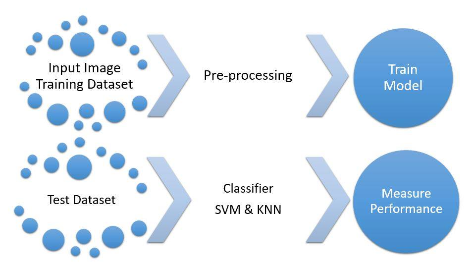
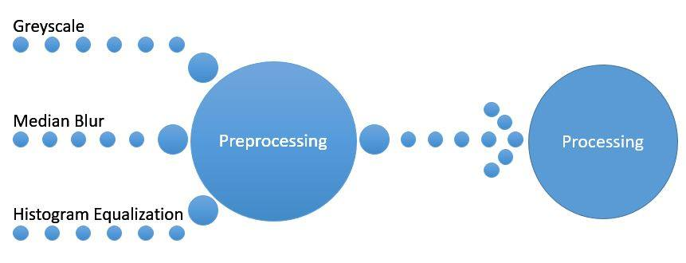

# Character Recognition
## Problem Description
**Text Recognition** is the problem of recognizing text in an image. Many problems need to be solved in order to read text in natural images includes text localization, character and word segmentation, recognition, etc. In our work, we have focused on recognition of individual characters in such images.

We have implemented our models based on Campos et al.[1]. Below we provide details of our implementation.

## Dataset
The detailed description about the dataset [2] is stated below.
- 64 classes (0 − 9, A − Z, a − z)
- 7705 characters obtained from natural images
- 3410 hand drawn characters using a tablet PC
- 62992 synthesised characters from computer fonts

This gives a total of over 74K images (which explains the name of the dataset). We only use 64 classes (0−9 A−Z, a − z) for our project.

## Explanation of the Models

Figure 1 shows the block diagram of our model and Figure 2 shows the preprocessing techniques used in our model.
**Image pre-processing:** For removing noise in image we implemented Median blur & Gaussian blur filter. We
got the idea from Patel et al. [3]. Then we converted the RGB image to Greyscale image. Finally, we resized the images into 30 × 30 for faster training.

**Figure 1:** Block diagram of our model

**Figure 2:** Preprocessing techniques of our model

**Classifiers:** For classifier, we used Support Vector Machine(SVM) and K-Nearest Neighbor(KNN).

**SVM** is a supervised machine learning algorithm that can be employed for both classification and regression purposes. Basically, SVM finds a hyperplane that divides the dataset into classes. Support vectors are the points nearest to the hyperplane. The hyperplane may be altered if any support vectors are removed from the dataset.
SVM uses different kernels to find the hyperplane in various ways. *RBF* (Radical Basis Function) is one of the most used kernels for SVM. The gamma value of this kernel defines how far the influence of a single data point reaches. It varies when smaller or larger margin is allowed defined by the value ’c’.

**KNN** (K-Nearest Neighbour) is also a commonly used classification algorithm. The output from the classifier depends on the number of nearest neighbour taken. It uses a distance metric like *Euclidean Distance, Manhattan Distance* etc. to calculate the distance from k-nearest neighbours. Then it labels the data to the closest class from the distance metrics. Thus, KNN gives a very consistent result.

## Performance Analysis
We show the results of applying smoothing filter in Table 1. From table 1 we can clearly see that, using smoothing filter, increased the accuracy of classifier SVM’s recognition.

| **Input** |         **Filter**        | **Accuracy** |
|:-----:|:---------------------:|---------:|
|  SVM  |   With smooth filter  |   92.2%  |
|       | Without smooth filter |   90.1%  |

Table 1: Using different pre-processing techniques using SVM

We also compared SVM classifier’s accuracy with KNN classifier. We showed some comparisons by using and not using smoothing filter in Table 2.

| **Input** |         **Filter**        | **Accuracy** |
|:-----:|:---------------------:|:--------:|
| k = 1 |   With smooth filter  |    55%   |
|       | Without smooth filter |    50%   |
| k = 3 |   With smooth filter  |   47.5%  |
|       | Without smooth filter |   47.7%  |
| k = 5 |   With smooth filter  |   48.0%  |
|       | Without smooth filter |   49.9%  |

Table 2: Using different pre-processing techniques using KNN

From Table 3 we can see that, using smoothing filter and Histogram Equalization, we achieved the highest
accuracy of classifier KNN’s recognition.

<table class="tg">
  <tr>
    <th class="tg-88nc" colspan="2">Input</th>
    <th class="tg-88nc">Accuracy</th>
  </tr>
  <tr>
    <td class="tg-0lax">k = 1</td>
    <td class="tg-baqh">With smooth filter + Histogram Equalization</td>
    <td class="tg-baqh">59%</td>
  </tr>
  <tr>
    <td class="tg-baqh">k = 3</td>
    <td class="tg-baqh">With smooth filter + Histogram Equalization</td>
    <td class="tg-baqh">56.5%</td>
  </tr>
  <tr>
    <td class="tg-baqh">k = 5</td>
    <td class="tg-baqh">With smooth filter + Histogram Equalization</td>
    <td class="tg-baqh">55.9%</td>
  </tr>
</table>

Table 3: Different pre-processing techniques using KNN

## Discussion

From above analysis, we came to acknowledge that SVM performs better than K-Nearest Neighbor in this dataset [2]. There are still some limitations of our work. Our model cannot classify images outside of this dataset [2]. In future, we will try to add more preprocessing techniques and further analyze the results of our classifiers. We believe that, by using Convolutional Neural Network we can improve the accuracy and detect images outside of this dataset.

## Run the code
To run the code simply run GUIDesign.ipynb file.

## References

[1] De Campos, T. E., Babu, B. R., Varma, M., et al. Character recognition in natural images. VISAPP (2)
7 (2009).

[2] de Campos, T. E.Babu, B. R. Chars74k dataset, 2009. http://www.ee.surrey.ac.uk/CVSSP/demos/chars74k/

[3] Patel, I., Jagtap, V., and Kale, O. A survey on feature extraction methods for handwritten digits recognition. International Journal of Computer Applications 107, 12 (2014).
